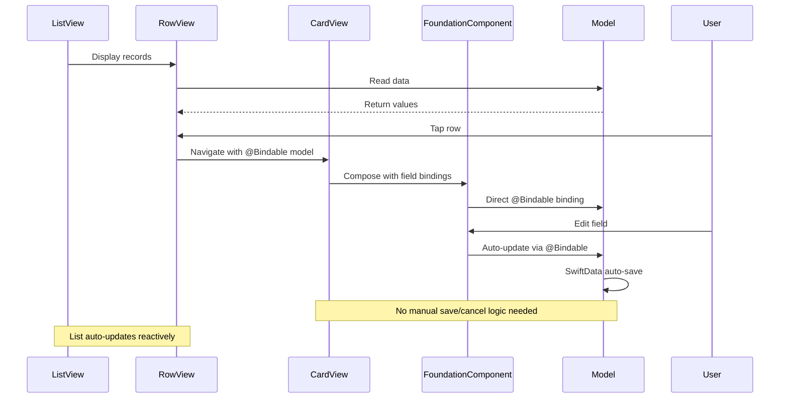
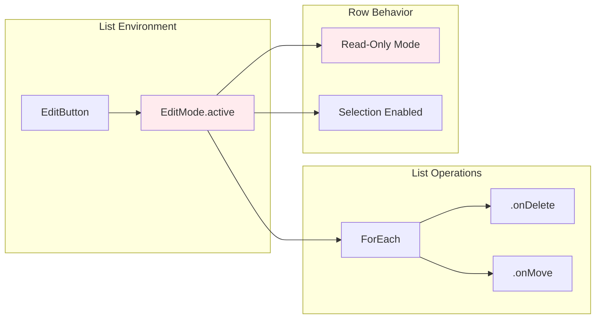

# Views Architecture Diagram

```mermaid
graph TB
    subgraph "Foundation Components (Reusable)"
        MF[MeasurementField]
        CF[CalorieField]
        DF[DateField]
        DSI[DataSourceIndicator]
    end

    subgraph "Row Components (List Display)"
        WRV[WeightRowView]
        DERV[DietaryEnergyRowView]
        AERV[ActiveEnergyRowView]
        CBRV[CalorieBudgetRowView]
    end

    subgraph "Card Components (Detail/Edit)"
        WCV[WeightCardView]
        DECV[DietaryEnergyCardView]
        AECV[ActiveEnergyCardView]
        CBCV[CalorieBudgetCardView]
    end

    subgraph "Views Using Components"
        DV[DashboardView]
        LV[HistoryListView]
        SV[StatsView]
    end

    subgraph "Data Models"
        W[Weight]
        DE[DietaryEnergy]
        AE[ActiveEnergy]
        CB[CalorieBudget]
    end

    %% Foundation components used by Card components
    MF --> WCV
    MF --> DECV
    MF --> AECV
    CF --> DECV
    CF --> AECV
    CF --> CBCV
    DF --> WCV
    DF --> DECV
    DF --> AECV
    DSI --> WCV
    DSI --> DECV
    DSI --> AECV

    %% Row components used by Views
    WRV --> DV
    DERV --> DV
    AERV --> DV
    CBRV --> DV
    WRV --> LV
    DERV --> LV

    %% Card components used by Views (via navigation)
    WCV --> DV
    DECV --> DV
    AECV --> DV
    CBCV --> DV

    %% Models bind to components
    W --> WRV
    W --> WCV
    DE --> DERV
    DE --> DECV
    AE --> AERV
    AE --> AECV
    CB --> CBRV
    CB --> CBCV

    style MF fill:#e1f5fe
    style CF fill:#e1f5fe
    style DF fill:#e1f5fe
    style DSI fill:#e1f5fe
    style WRV fill:#f3e5f5
    style DERV fill:#f3e5f5
    style AERV fill:#f3e5f5
    style CBRV fill:#f3e5f5
    style WCV fill:#e8f5e8
    style DECV fill:#e8f5e8
    style AECV fill:#e8f5e8
    style CBCV fill:#e8f5e8
```

## Data Flow Pattern

```mermaid
sequenceDiagram
    participant LV as ListView
    participant RV as RowView
    participant CV as CardView
    participant FC as FoundationComponent
    participant M as Model

    LV->>RV: Display records
    RV->>M: Read data
    M-->>RV: Return values

    User->>RV: Tap row
    RV->>CV: Navigate with @Bindable model

    CV->>FC: Compose with field bindings
    FC->>M: Direct @Bindable binding

    User->>FC: Edit field
    FC->>M: Auto-update via @Bindable
    M->>M: SwiftData auto-save

    Note over CV,M: No manual save/cancel logic needed
    Note over RV,LV: List auto-updates reactively
```

## Integration with SwiftUI List Editing

```mermaid
graph LR
    subgraph "List Environment"
        EM[EditMode.active]
        EB[EditButton]
    end

    subgraph "List Operations"
        OD[.onDelete]
        OM[.onMove]
        FE[ForEach]
    end

    subgraph "Row Behavior"
        RO[Read-Only Mode]
        SE[Selection Enabled]
    end

    EB --> EM
    EM --> FE
    FE --> OD
    FE --> OM
    EM --> RO
    EM --> SE

    style EM fill:#ffebee
    style RO fill:#ffebee
```
