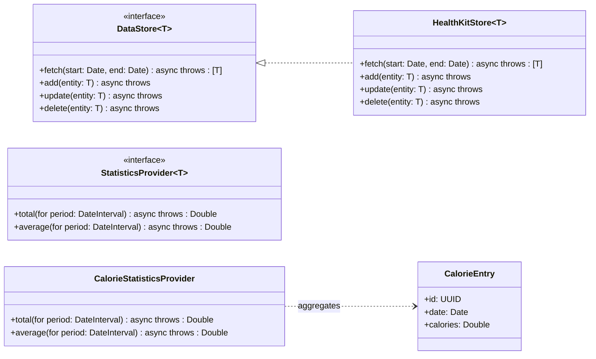
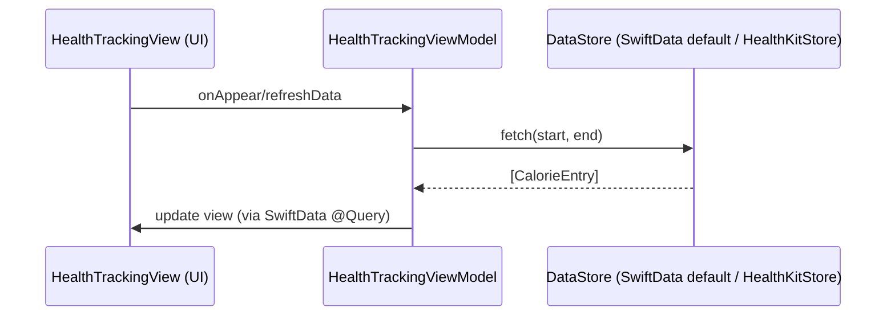

# Modular Health Data Tracker – MVP Architecture

## Overview

- **Goal:** A modular, decoupled health data tracker.
- **MVP Focus:** Calories, basic budget/statistics, and settings.
- **Data Sources:** HealthKit for health data; SwiftData for persistence/UI reactivity.

## Core Principles

- **Decoupling:**
  - Define a common storage interface (`DataStore`) to support multiple implementations.
  - Each data type (calories, weight, etc.) has its own module defining storage and retrieval.
  - A separate, generic statistics module handles aggregations (e.g., weekly totals, budget calculations).

- **Modularity:**
  - Ensure SwiftData’s default store can be swapped with HealthKit (or vice versa) with minimal friction.
  - Only implement a custom store (e.g., `HealthKitStore`) when needed, while leveraging SwiftData’s built-in default store.

- **Reactivity:**
  - Use SwiftData’s `@Query` wrappers to automatically update the UI.
  - Design in a way that simple loading indicators can be incorporated if data retrieval delays occur.

## MVP Features

- **Calorie Tracking:** Read/write calorie data via HealthKit.
- **Basic Statistics:** Compute totals/averages and budget remaining over custom periods (initial focus on weekly data).
- **Settings Storage:** Use SwiftData’s default store for non-health data.

## Future Considerations

- Expand to additional metrics (e.g., weight, macros).
- Add custom statistical queries on demand.
- Maintain a lean design to avoid over-engineering while ensuring modularity for iterative improvements.

## Design

### Class Diagram

### Sequence Diagram

