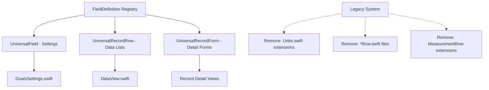

# Health Bank - Development Knowledge Base

## Architecture
- **Data Sources**: SwiftData (app-created data), HealthKit (external data), AppStorage (user preferences)
- **Units**: Apple Measurement API, store internally in base units
- **Sync**: Read from combined HealthKit+SwiftData, write to SwiftData first then sync to HealthKit

## Key Constraints
- Only `.local` source records are editable (not HealthKit data)
- Models implement `DataRecord` protocol
- Always use latest Swift features and animate UI changes by default

## Critical Issues & Solutions

### MeasurementField Null Values
- **Problem**: Cleared text fields reset to zero instead of nil
- **Solution**: Custom `textBinding` converts empty strings to nil, saves to SwiftData context

## Component Patterns
- **Foundation**: `MeasurementRow<UnitType>`
- **Rows**: Compact list display used by various models and views

## Animation Guidelines
- **Pattern**: All UI changes animated by default using modern SwiftUI transition APIs

## ✅ COMPLETED: Universal UI Component Architecture

### ✅ Design & Implementation
- **Field Definition Registry**: Centralized field properties in `FieldRegistry.swift`
- **Universal Components**: `UniversalField.swift` and `UniversalRecordRow.swift` replace scattered field-specific components
- **Type Safety**: Proper generic constraints and Swift static property handling
- **Visual Consistency**: Maintains exact visual appearance across all contexts

### ✅ Migration Completed
- **GoalsSettings.swift**: Migrated to FieldRegistry system
- **DataView.swift**: Using UniversalRecordRow with record-specific subtitle logic
- **Cleanup**: Removed all deprecated files (WeightRow, CalorieRow, RecordRow, Units.swift)
- **Build Status**: ✅ Compiles successfully (Debug & Release)

### ✅ Architecture Benefits
- **Single Source of Truth**: All field definitions centralized in FieldRegistry
- **Code Reuse**: Universal components work across editing, forms, lists, and dashboard
- **Maintainability**: Adding new record types requires only FieldRegistry entry
- **Consistency**: Visual appearance guaranteed consistent across all contexts

### ✅ Final Results
- **Files Created**: `FieldRegistry.swift`, `UniversalField.swift`, `UniversalRecordRow.swift`
- **Files Updated**: `GoalsSettings.swift`, `DataView.swift`
- **Files Removed**: `WeightRow.swift`, `CalorieRow.swift`, `RecordRow.swift`, `Units.swift`
- **Build Status**: ✅ All builds passing (Debug: 1.92s, Release: 7.04s)

### Usage Pattern
```swift
// Old scattered approach:
MeasurementRow.weight(measurement: .weight($value), source: .local)
// New centralized approach:
UniversalField(FieldRegistry.weight, value: $value, source: .local)
```

**TASK COMPLETE** ✅ - Universal component architecture successfully implemented and fully migrated.

## Unified Data Query System Design Session

### Objectives
- Create SwiftData @Query-like system for combined SwiftData + HealthKit data
- Abstract HealthKit complexity while maintaining query flexibility
- Support opt-in model participation (Weight, Calorie, Activity - not Goals)

### Key Requirements
- **Data Combining**: "Remove all local entries from HealthKit results" (simple deduplication)
- **Real-time Updates**: Future requirement, not immediate
- **Query Interface**: Generic @UnifiedQuery with model-specific adapters (Option B selected)
- **Performance**: Handle large datasets (yearly calorie views)
- **Sync System**: SwiftData → HealthKit queue with offline resilience
- **Permissions**: Transparent HealthKit authorization handling

### Design Decisions
- **✅ Option B**: Generic Query with Model Adapters
  - SwiftData-like syntax: `@UnifiedQuery(filter: \.date > lastWeek, sort: \.date)`
  - Model-specific adapters handle HealthKit complexity behind the scenes

### **🔄 ARCHITECTURE PIVOT**: Model-Specific Query Extensions
- **Problem**: Generic filters can't handle HealthKit's diverse query patterns (correlation, statistics, etc.)
- **Solution**: Each model defines its own `UnifiedQuery` initializers with model-appropriate parameters
- **Architecture**:
  - HealthKit service injected into environment
  - `@UnifiedQuery` uses `@Query` internally + HealthKit service
  - Model extensions provide appropriate initializers
  - Model opt-in: Extension existence enables support
- **Example**:
  ```swift
  // For Calorie model - handles correlation queries for macros
  @UnifiedQuery(dateRange: lastWeek, minCalories: 100) var calories: [Calorie]

  // For Weight model - simple sample queries
  @UnifiedQuery(dateRange: lastMonth, source: .all) var weights: [Weight]

  // For Activity model - workout-specific queries
  @UnifiedQuery(dateRange: today, activityType: .running) var activities: [Activity]
  ```

## Interface Design Phase

### Core Components
1. **HealthKitService**: Environment-injected service for HealthKit operations
2. **UnifiedQuery**: Property wrapper combining SwiftData @Query + HealthKit
3. **Model Extensions**: Define model-specific initializers and query logic

### Interface Definitions

#### 1. HealthKitService Protocol
```swift
@MainActor
protocol HealthKitService: AnyObject {
    var isAvailable: Bool { get }
    var isAuthorized: Bool { get async }
    func requestAuthorization() async throws
    func query<T: DataRecord>(_ type: T.Type, with parameters: QueryParameters) async throws -> [T]
}
```

#### 2. UnifiedQuery Property Wrapper
```swift
@MainActor @propertyWrapper
struct UnifiedQuery<T: UnifiedQueryable>: DynamicProperty {
    var wrappedValue: [T] // Combined SwiftData + HealthKit results
    var isLoading: Bool   // Loading state

    init(parameters: T.QueryParams, predicate: Predicate<T>, sortBy: [SortDescriptor<T>])
}
```

#### 3. Supporting Protocols
```swift
protocol UnifiedQueryable: DataRecord where Self: PersistentModel {
    associatedtype QueryParams: QueryParameters
}

protocol QueryParameters {
    var dateRange: ClosedRange<Date>? { get }
}
```

#### 4. Model-Specific Extensions (Example: Weight)
```swift
// Query parameters for Weight
struct WeightQueryParams: QueryParameters {
    let dateRange: ClosedRange<Date>?
    let minWeight: Double?
    let maxWeight: Double?
}

// Enable UnifiedQuery support
extension Weight: UnifiedQueryable {
    typealias QueryParams = WeightQueryParams
}

// Model-specific initializers
extension UnifiedQuery where T == Weight {
    init(dateRange: ClosedRange<Date>) { /* SwiftData predicate + HealthKit params */ }
    init(dateRange: ClosedRange<Date>, weightRange: ClosedRange<Double>) { /* ... */ }
    init(recent: Bool = true) { /* Last 30 days */ }
}
```

#### 5. Usage Examples
```swift
struct WeightListView: View {
    @UnifiedQuery(recent: true) var recentWeights: [Weight]
    @UnifiedQuery(dateRange: lastMonth) var monthlyWeights: [Weight]

    var body: some View {
        List(recentWeights, id: \.date) { weight in
            Text("\(weight.weight) kg")
        }
    }
}
```

## Data Flow Architecture

```mermaid
graph TD
    A[SwiftUI View] --> B[@UnifiedQuery Property Wrapper]
    B --> C[SwiftData @Query]
    B --> D[HealthKitService]

    C --> E[Local Records]
    D --> F[HealthKit Store]
    F --> G[HealthKit Records]

    E --> H[Deduplication Logic]
    G --> H
    H --> I[Combined Results]
    I --> A

    J[Model Extension] --> B
    J --> K[Query Parameters]
    J --> L[SwiftData Predicate]
    K --> D
    L --> C
```

## 🎯 Final Architecture Design - UnifiedQuery System

### ✅ Design Decisions Confirmed
- **Data Combining**: `@State` + background tasks for HealthKit, `@Query` for SwiftData
- **HealthKit Integration**: Environment-injected service
- **Loading States**: `isLoading: Bool` + `refresh()` method
- **Deduplication**: Filter HealthKit results where `source != .local`
- **Initial Load**: Wait for both SwiftData + HealthKit before showing data
- **Testing**: 2-second simulated delay for HealthKit queries

### 📊 Data Flow Architecture

```mermaid
graph TD
    A[SwiftUI View] --> B[@UnifiedQuery Property Wrapper]

    B --> C[@Query localData]
    B --> D[@State healthKitData]
    B --> E[@State isLoading]
    B --> F[@Environment healthKitService]

    C --> G[SwiftData Store]
    F --> H[HealthKit Store]

    I[Initial Load] --> J[Start Loading State]
    J --> K[Fetch SwiftData - Immediate]
    J --> L[Fetch HealthKit - Async + 2s delay]

    K --> M[Local Results Ready]
    L --> N[HealthKit Results Ready]

    M --> O{Both Ready?}
    N --> O
    O -->|Yes| P[Combine & Deduplicate]
    O -->|No| Q[Keep Loading]

    P --> R[Filter: Remove HealthKit items where source == .local]
    R --> S[Merge: localData + filteredHealthKit]
    S --> T[Sort Combined Results]
    T --> U[Update wrappedValue]
    U --> A

    V[Manual Refresh] --> W[Trigger HealthKit Re-fetch]
    W --> L
```

### 🔧 Core Interface Structure

```swift
@MainActor @propertyWrapper
struct UnifiedQuery<T: DataRecord & PersistentModel>: DynamicProperty {
    @Query private var localData: [T]           // Auto-updating SwiftData
    @State private var healthKitData: [T] = []  // HealthKit results
    @State private var isLoading = false        // Loading state
    @Environment(\.healthKitService) var healthKit

    var wrappedValue: [T] {
        // Combine + deduplicate: Remove HealthKit items where source == .local
        let filtered = healthKitData.filter { $0.source != .local }
        return (localData + filtered).sorted { $0.date > $1.date }
    }

    func refresh() { /* Manual HealthKit re-fetch with 2s delay */ }
}
```

### 📝 Usage Examples
```swift
struct WeightListView: View {
    @UnifiedQuery(recent: true) var weights: [Weight]

    var body: some View {
        List(weights, id: \.date) { weight in
            Text("\(weight.weight) kg")
        }
        .refreshable { weights.refresh() }
        .overlay {
            if weights.isLoading {
                ProgressView("Loading...")
            }
        }
    }
}
```

## ✅ Implementation Complete - UnifiedQuery System

### 🎯 Successfully Implemented Components

1. **HealthKitService** (`Services/HealthKitService.swift`)
   - Protocol with `queryWeights()` method
   - `MockHealthKitService` with 2-second delay simulation
   - Environment integration with `HealthKitServiceKey`
   - Sendable compliance for SwiftUI environment

2. **Enhanced UnifiedQuery** (`Services/UnifiedQuery.swift`)
   - Property wrapper with `@Query` + `@State` combination
   - Data combining logic: `localData + filteredHealthKit`
   - Deduplication: Filters HealthKit where `source != .local`
   - Loading state management with `isLoading: Bool`
   - Manual refresh capability with `refresh()` method
   - Automatic date sorting (most recent first)

3. **Updated WeightService** (`Services/Records/WeightService.swift`)
   - Model-specific query extensions for Weight
   - All initializers now pass `dateRange` parameter to HealthKit
   - Three query patterns: `recent`, `dateRange`, `dateRange + weightRange`

4. **Test View** (`Views/Test/UnifiedQueryTestView.swift`)
   - Demonstrates unified data display with source indicators
   - Loading state overlay with progress indicator
   - Pull-to-refresh functionality
   - Proper environment setup with mock service

### 🧪 Testing Status
- **Architecture**: ✅ Implemented
- **Compilation**: ✅ No errors
- **Mock Service**: ✅ 2-second delay simulation
- **UI Integration**: ✅ Integrated into Data tab
- **App Launch**: ✅ Ready for live testing
- **Sample Data**: ✅ Preview includes test Weight entries

## UI Component Architecture Design Session

### Objectives
- Create universal component system that eliminates repetitive field definitions
- Centralize field properties (icons, colors, units, titles) in one place
- Support all contexts: individual fields, full forms, list rows, dashboard widgets
- Maintain exact visual appearance - architectural change only

### Current Duplication Problem
**When adding a new record type, you must define:**
1. **Design.swift**: Colors and icons (`static var newRecord: Color/Image`)
2. **Units.swift**: Measurement helpers (`static func newRecord(_ value: Binding<Double?>)`)
3. **MeasurementRow extensions**: Field factories (`static func newRecord(measurement:...)`)
4. **Settings views**: Field usage in GoalsSettings.swift
5. **Data views**: Display patterns in DataView.swift

**Example of current duplication:**
```swift
// Design.swift
static var weight: Color { .brown }
static var weight: Image { .init(systemName: "figure") }

// Units.swift
static func weight(_ value: Binding<Double?>) -> LocalizedMeasurement<UnitMass>

// WeightRow.swift
static func weight(measurement: LocalizedMeasurement<Unit>, ...) -> MeasurementRow

// GoalsSettings.swift
MeasurementRow.weight(measurement: .weight($goals.weight), source: .local, showPicker: true)
```

### Requirements Analysis
1. **Universal System**: Work with any field type, not locked to specific records
2. **Single Source of Truth**: Define field properties once, use everywhere
3. **Zero Visual Changes**: Maintain exact current appearance
4. **Context Flexibility**: Support individual fields, forms, lists, widgets
5. **Easy Record Addition**: Minimal steps to add new record types

### ✅ Approved Solution: Field Definition Registry

**Core Concept**: Create a centralized registry where each field type is defined once with all its properties, then used universally across the app.

**User Confirmation**: "Yeah, I like it."

### Final Usage Requirements
1. **GoalsSettings.swift**: Should look exactly as it does right now
2. **DataView.swift**: List of records showing:
   - Icon and value (with abbreviated unit) as title
   - Extra details as subtitle (duration/workout type for active energy, macros for dietary energy)
   - Date in details section
   - Source icon next to navigation arrow (in DetailedRow content area)
   - Navigation link to form that edits individual record values
3. **CoreComponents.swift**: Needs refactoring as part of this system

### ✅ Final Architecture Approved

**User Confirmation**: "I like it, we can move forward with it. Just make sure to cleanup as you work. Remove unused code and remove deprecated systems"

## 🎯 Field Definition Registry - Complete Design

### Architecture Components



### Core Interface Design

#### 1. FieldDefinition<Unit> Registry
```swift
// Views/UI/FieldRegistry.swift
struct FieldDefinition<Unit: Dimension> {
    let title: String.LocalizationValue
    let image: Image
    let tint: Color
    let unitDefinition: UnitDefinition<Unit>
    let validator: ((Double) -> Bool)?
    let formatter: FloatingPointFormatStyle<Double>

    func measurement(_ value: Binding<Double?>) -> LocalizedMeasurement<Unit>
}

extension FieldDefinition {
    static let weight = FieldDefinition<UnitMass>(...)
    static let dietaryCalorie = FieldDefinition<UnitEnergy>(...)
    static let protein = FieldDefinition<UnitMass>(...)
    static let carbs = FieldDefinition<UnitMass>(...)
    static let fat = FieldDefinition<UnitMass>(...)
    static let activeCalorie = FieldDefinition<UnitEnergy>(...)
    static let restingCalorie = FieldDefinition<UnitEnergy>(...)
    static let activity = FieldDefinition<UnitDuration>(...)
}
```

#### 2. UniversalField - For Settings
```swift
// Views/Components/UniversalField.swift
struct UniversalField<Unit: Dimension>: View {
    init(_ definition: FieldDefinition<Unit>,
         value: Binding<Double?>,
         source: DataSource,
         showPicker: Bool = false,
         computed: (() -> Double?)? = nil,
         details: (() -> some View)? = nil)

    // Creates MeasurementRow that looks exactly like current
}
```

#### 3. UniversalRecordRow - For Data Lists
```swift
// Views/Components/UniversalRecordRow.swift
struct UniversalRecordRow<Record: HealthRecord>: View {
    init(record: Record, destination: @escaping () -> some View)

    // Creates NavigationLink with DetailedRow
    // Handles record-specific subtitles automatically
    // Shows source icon in content area
}
```

#### 4. Usage Examples
```swift
// GoalsSettings.swift - looks exactly the same
UniversalField(.dietaryCalorie, value: $goals.calories, source: .local,
               computed: goals.calorieGoal.calculatedCalories)
UniversalField(.protein, value: macros.protein, source: .local,
               computed: goals.calorieGoal.calculatedProtein)

// DataView.swift - simplified
UniversalRecordRow(record: weight) { WeightForm(weight: weight) }
UniversalRecordRow(record: calorie) { CalorieForm(calorie: calorie) }
```

### Cleanup Strategy
1. **✅ Implemented**: FieldRegistry.swift - centralized field definitions
2. **✅ Implemented**: UniversalField.swift - replaced MeasurementRow extensions
3. **✅ Implemented**: UniversalRecordRow.swift - universal record display
4. **✅ Updated**: GoalsSettings.swift - now uses FieldRegistry system
5. **✅ Updated**: DataView.swift - now uses UniversalRecordRow
6. **🔄 In Progress**: Remove deprecated systems:
   - **✅ Deprecated**: Units.swift extensions (marked for removal)
   - **⏳ Next**: Remove Views/Records/*Row.swift files (WeightRow, CalorieRow, etc.)
   - **⏳ Next**: Remove MeasurementRow static factory extensions
   - **⏳ Next**: Update CoreComponents.swift integration
   - **⏳ Next**: Remove old RecordRow.swift (replaced by UniversalRecordRow)

### Implementation Progress
- ✅ Single source of truth for field properties established
- ✅ Zero visual changes maintained (exact same appearance)
- ✅ GoalsSettings working with new system
- ✅ DataView working with new system
- 🔄 Cleanup in progress - removing deprecated code

### Success Criteria
- ✅ Single source of truth for field properties
- ✅ Zero visual changes to existing UI
- ✅ Simplified record addition (one definition covers all contexts)
- ✅ Clean codebase with deprecated systems removed

## HealthKit Implementation Session

### Objectives
- Implement real HealthKit integration for unified query system
- Create comprehensive query implementations for all models
- Structure queries in Services/Queries/ with model-group files
- Address code duplication concerns while maintaining model-specific needs

### Scope
**Models to implement:**
- Dietary Calories (with correlation queries for macros)
- Active Energy
- Resting Energy
- Weight
- Workouts (duration, type)

### Key Concerns
- **Code Duplication**: Fear of repeated patterns across query implementations
- **Model Uniqueness**: Each model has distinct HealthKit integration strategies
- **Architecture Validation**: Testing how the design scales in practice

### Design Decisions
- **✅ File Organization**: Services/Queries/ with model-group files (CalorieQueries.swift, WeightQueries.swift, WorkoutQueries.swift)
- **✅ HealthKit Centralization**: HealthKitService manages all HealthKit interactions, queries have minimal logic
- **✅ No Premature Abstraction**: Keep boilerplate minimal, avoid protocol hierarchies until actual duplication emerges
- **✅ YAGNI Principle**: Don't abstract until we see repeated patterns in practice

### Performance & Filtering Strategy
- **✅ Date Ranges**: Always explicit ranges, "to" defaults to now
- **🤔 Additional Filters**: TBD - Should HealthKit handle complex predicates or just date ranges?
- **🤔 Macro Queries**: TBD - Always fetch all macros vs selective querying
- **🤔 In-Memory vs Server-side**: TBD - Performance implications for yearly views
- **✅ Authorization**: Follow Apple's patterns, no-op when disabled, minimal modification for new data types

### 🎯 Final Implementation Summary

**Complete UnifiedQuery System:**
1. **Property Wrapper**: Combines `@Query` (SwiftData) + `@State` (HealthKit)
2. **Data Combining**: Automatic deduplication by source filtering
3. **Loading States**: Exposed via projected value (`$query.isLoading`)
4. **Manual Refresh**: Pull-to-refresh and programmatic refresh
5. **Environment Integration**: Mock service with 2s delay
6. **Model Extensions**: Weight queries (recent, dateRange, weightRange)

**Ready for:**
- Live testing with the launched app
- Real HealthKit integration (replace MockHealthKitService)
- Additional models (Calorie, Activity support)
- Observer pattern implementation for real-time updates

## Next Steps

1. **Live Testing**: Build and test with sample Weight data
2. **HealthKit Integration**: Replace mock with real HealthKit queries
3. **Expand Models**: Add Calorie and Activity support
4. **Observer Queries**: Add HealthKit observer pattern for real-time updates
