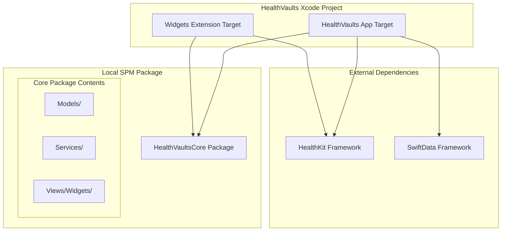
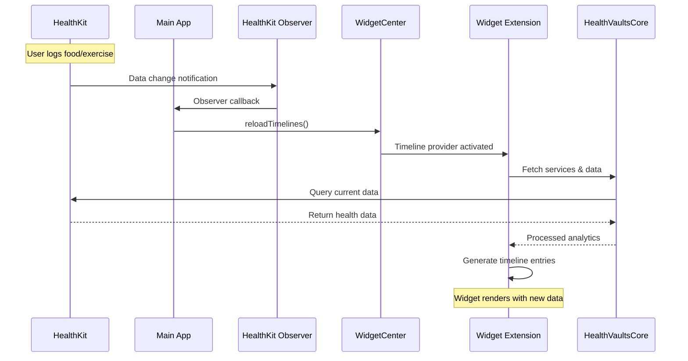
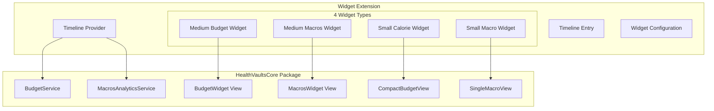

# HealthVaults Widget Integration Design Workshop

## Session Objective
Design and implement a robust widget system for HealthVaults that:
- Shares code between main app and widgets
- Provides identical dashboard experience
- Updates automatically when HealthKit data changes
- Maintains optimal performance and user experience

## Current Architecture Analysis
### App Structure:
- **SwiftUI + SwiftData**: Main app with local persistence
- **HealthKit Integration**: External health data source
- **Analytics Services**: Budget, Macros, Weight analytics with async data loading
- **Dashboard Widgets**: BudgetWidget, MacrosWidget, OverviewWidget
- **Package-based**: Using SPM with separate widget target

### Key Services Identified:
- `BudgetService`: Calorie budget calculations with HealthKit data
- `MacrosAnalyticsService`: Macro nutrient analysis
- `DataAnalyticsService`: Base analytics functionality
- All services use async data loading with `@BudgetAnalytics` and `@MacrosAnalytics` property wrappers

### Current Widget State:
- Basic WidgetKit extension created
- Placeholder timeline provider implementation
- No code sharing with main app yet

## Requirements Discovery Questions

## WidgetKit Research Findings

### Core WidgetKit Architecture
**Widget Extension Structure:**
- **Timeline Entry**: Model object containing date + custom data for each widget state
- **Timeline Provider**: Handles data fetching and timeline generation (placeholder, snapshot, timeline methods)
- **Widget View**: SwiftUI view that renders the widget UI
- **Widget Configuration**: Defines widget metadata and behavior
- **Widget Extension Target**: Separate target that shares code with main app

**Key Insights:**
- Widgets run in separate process - not continuously active
- WidgetKit renders views on behalf of your extension
- Timeline-based updates with refresh strategies: `.atEnd`, `.never`, `.after(date)`
- Support for multiple widget families (small, medium, large, extra large)

### Code Sharing & Project Structure
**Target Configuration:**
- Widget extensions are separate targets that can import shared frameworks
- Common approach: Create shared framework containing models, services, and views
- App and Widget extension both depend on shared framework
- Alternatively, use Swift Package Manager for shared code

**Data Flow:**
- Main app uses `WidgetCenter.shared.reloadTimelines(ofKind:)` to trigger widget updates
- Widget timeline provider fetches data independently
- Background network requests supported during timeline generation

### Data Update Strategies
**Timeline Management:**
- **Predictable Updates**: Generate timeline entries for known future states
- **Dynamic Updates**: Use `WidgetCenter` to reload when app data changes
- **Real-time Elements**: SwiftUI Text views can show auto-updating dates/timers
- **Background Refresh**: Network requests during timeline generation

**HealthKit Integration Considerations:**
- HealthKit queries can be performed in widget timeline provider
- Widget extension needs HealthKit entitlements
- Timeline refresh triggered by app when HealthKit data changes
- Observer queries in main app can trigger widget reloads

### Advanced Features
**User Configuration:**
- `AppIntentConfiguration` for user-customizable widgets
- Intent-based configuration for widget personalization
- Multiple widget instances with different configurations

**Deep Linking:**
- Widget tap actions can open specific app scenes
- URL schemes or universal links for navigation
- Button actions within widgets (iOS 17+)

**Visual Enhancements:**
- Accented rendering mode for system-wide theming
- Container backgrounds for proper widget appearance
- Rich media support (images, limited animations)
- Responsive layouts for different widget sizes

### Technical Constraints
**Performance Limitations:**
- Limited memory and CPU time for timeline generation
- Network requests must complete during timeline provider execution
- No persistent background processing
- System manages widget refresh frequency

**Update Frequency:**
- System intelligently schedules widget updates based on user interaction
- Frequent updates may be throttled to preserve battery
- Push notifications can trigger widget updates (iOS 17+)

### Recommended Architecture Patterns
**For HealthVaults:**
1. **Shared Framework Approach**: Create `HealthVaultsCore` framework
2. **Service Layer Sharing**: Export analytics services to shared framework
3. **View Component Reuse**: Share dashboard widget views between app and widget extension
4. **Data Synchronization**: Use `WidgetCenter` to update widgets when HealthKit data changes
5. **Timeline Strategy**: Generate timeline entries based on typical user interaction patterns

### Implementation Considerations
**Priority Features:**
- Multiple widget sizes showing different detail levels
- Real-time calorie budget updates
- Macro tracking widgets
- Deep linking to specific app sections
- Consistent visual design with main app

**Technical Challenges:**
- HealthKit permission sharing between app and widget
- Efficient data fetching in timeline provider
- Handling offline/error states gracefully
- Optimizing battery usage with appropriate refresh frequencies

---

## Requirements Clarification - Session 1

### Widget Scope & Specifications
**Confirmed Widget Set:**
1. **Medium Budget Widget**: Identical to existing dashboard BudgetWidget
2. **Medium Macros Widget**: Identical to existing dashboard MacrosWidget
3. **Small Calorie Widget**: Compact view of budget information
4. **Small Configurable Macro Widget**: User-selectable single macro display (like emoji picker pattern)

### Update Strategy
**HealthKit Observer-Based Updates:**
- Widgets update only when HealthKit data actually changes
- Main app maintains HealthKit observer queries
- Observer triggers `WidgetCenter.shared.reloadTimelines()` on data changes
- No predictive timeline generation - reactive updates only

### Deep Linking Target
**Navigation Destination:**
- All widget taps navigate to main Dashboard view
- Consistent user experience returning to central hub

### Pending Architecture Decision
**Code Sharing Approach:** Need to compare options for shared framework vs SPM approach

## Architecture Options Analysis

Let me outline the **code sharing approaches** with pros/cons to help you decide:

### Option A: Shared Framework Target
**Structure:**
```
HealthVaults.xcodeproj
├── HealthVaults (Main App)
├── Widgets (Widget Extension)
└── HealthVaultsCore (Framework)
    ├── Models/
    ├── Services/
    └── Views/Analytics/Widgets/
```

**Pros:**
- Clean separation of shared code
- Explicit dependency management
- Easy to reason about what's shared
- Framework can be unit tested independently

**Cons:**
- Additional target complexity
- Framework overhead (minimal)
- Need to mark public APIs explicitly

### Option B: Swift Package Manager
**Structure:**
```
HealthVaults/
├── App/ (existing)
├── Widgets/ (existing)
└── Packages/
    └── HealthVaultsCore/
        ├── Sources/HealthVaultsCore/
        └── Package.swift
```

**Pros:**
- Modern Swift ecosystem approach
- Better for future modularization
- Cleaner build dependencies
- Version management capabilities

**Cons:**
- More complex project structure
- Potential Xcode integration quirks
- Learning curve if unfamiliar

### Architecture Decision - CONFIRMED
**Selected Approach: Swift Package Manager**

**Rationale:**
- Modern Swift ecosystem approach
- Better for future modularization
- Cleaner build dependencies
- Aligns with project's existing SPM usage

---

## Visual Architecture Design

### Project Structure Overview


### Data Flow Architecture


### Widget Component Architecture


### Architecture Confirmation ✅
**User confirmed this high-level architecture is correct.**

## Implementation Timeline

**Current Phase: Design Workshop** (We are here)
- ✅ Requirements gathering
- ✅ Architecture visualization
- 🔄 **Next**: Data contracts & interfaces
- 🔄 **Next**: Execution plan with step-by-step tasks

**Next Phase: Implementation**
- Create SPM package structure
- Move shared code to package
- Implement widget timeline providers
- Create widget-specific views
- Set up HealthKit observer integration
- Test & refine

**Estimated time to start coding:** ~15-30 minutes (after we finish design phase)

---

## Data Contracts & Interface Design

Now let's define the **specific data structures and interfaces** your widgets will need:

### Timeline Entry Structures
```swift
// Budget-specific timeline entry
struct BudgetTimelineEntry: TimelineEntry {
    let date: Date
    let budgetData: BudgetAnalytics?
    let isDataStale: Bool
}

// Macros-specific timeline entry
struct MacrosTimelineEntry: TimelineEntry {
    let date: Date
    let macrosData: MacrosAnalytics?
    let isDataStale: Bool
}

// Single macro timeline entry (uses existing app enum)
struct SingleMacroTimelineEntry: TimelineEntry {
    let date: Date
    let macrosData: MacrosAnalytics?
    let selectedMacro: /* Your existing macro enum */ // From shared package
    let isDataStale: Bool
}
```

### Widget Configuration
```swift
// Uses your existing macro enum from the shared package
// No new enum needed - will import from HealthVaultsCore
```

### Service Interface Requirements
```swift
// What the shared services need to provide for widgets
protocol WidgetDataProvider {
    func getBudgetAnalytics() async -> BudgetAnalytics?
    func getMacrosAnalytics() async -> MacrosAnalytics?
    func isHealthKitAuthorized() -> Bool
}
```

### Data Contracts - APPROVED ✅
**User confirmed the refined data structure approach:**
- ✅ Separate timeline entries for each widget type (no unnecessary data)
- ✅ Use existing app enums from shared package (no duplication)
- ✅ Service interface looks good

---

## Final Design Solution

Now I'll create your **complete execution plan** with step-by-step implementation tasks:

## Implementation Execution Plan

### Phase 1: SPM Package Setup (15-20 minutes)
**Task 1.1: Create Package Structure**
```bash
mkdir -p Packages/HealthVaultsCore/Sources/HealthVaultsCore
cd Packages/HealthVaultsCore
```

**Task 1.2: Create Package.swift**
```swift
// swift-tools-version: 5.9
import PackageDescription

let package = Package(
    name: "HealthVaultsCore",
    platforms: [.iOS(.v17)],
    products: [
        .library(name: "HealthVaultsCore", targets: ["HealthVaultsCore"]),
    ],
    dependencies: [],
    targets: [
        .target(name: "HealthVaultsCore", dependencies: []),
    ]
)
```

**Task 1.3: Move Shared Code**
- Move `Models/` → `Sources/HealthVaultsCore/Models/`
- Move `Services/` (selected) → `Sources/HealthVaultsCore/Services/`
- Move `Views/Analytics/Widgets/` → `Sources/HealthVaultsCore/Views/`

**Task 1.4: Update Project Dependencies**
- Add HealthVaultsCore to main app target
- Add HealthVaultsCore to widget extension target

### Phase 2: Widget Timeline Providers (20-25 minutes)
**Task 2.1: Create Base Timeline Provider**
```swift
// In Widgets target
protocol HealthVaultsTimelineProvider {
    associatedtype Entry: TimelineEntry
    func getSnapshot() async -> Entry
    func getTimeline() async -> Timeline<Entry>
}
```

**Task 2.2: Implement Budget Provider**
```swift
struct BudgetTimelineProvider: AppIntentTimelineProvider {
    func timeline(for configuration: ConfigurationAppIntent, in context: Context) async -> Timeline<BudgetTimelineEntry> {
        // Use HealthVaultsCore.BudgetService
        // Generate timeline with current data
        // Return timeline with .never policy (observer-driven updates)
    }
}
```

**Task 2.3: Implement Macros Providers** (2 providers: full macros + single macro)

### Phase 3: Widget Views (15-20 minutes)
**Task 3.1: Create Widget View Adapters**
```swift
// Wrap existing views for widget context
struct BudgetWidgetView: View {
    let entry: BudgetTimelineEntry

    var body: some View {
        // Use existing BudgetWidget from HealthVaultsCore
        // Add widget-specific styling (.containerBackground, etc.)
    }
}
```

**Task 3.2: Create Compact Views** (Small calorie + single macro widgets)

### Phase 4: HealthKit Observer Integration (10-15 minutes)
**Task 4.1: Update Main App Observers**
```swift
// In main app - add to existing HealthKit observers
private func setupWidgetUpdates() {
    // When HealthKit data changes
    WidgetCenter.shared.reloadTimelines(ofKind: "BudgetWidget")
    WidgetCenter.shared.reloadTimelines(ofKind: "MacrosWidget")
    // etc.
}
```

**Task 4.2: Configure Widget Kinds**
- Define unique identifiers for each widget type
- Set up proper deep linking URLs

### Phase 5: Testing & Polish (10-15 minutes)
**Task 5.1: Test Widget Installation**
- Build and run widget extension
- Add widgets to home screen
- Verify data displays correctly

**Task 5.2: Test Update Flow**
- Log food in main app
- Verify widgets update automatically
- Test deep linking to dashboard

---

## Success Criteria Checklist
- [ ] SPM package successfully shares code between app and widgets
- [ ] 4 widgets display identical content to dashboard counterparts
- [ ] Widgets update automatically when HealthKit data changes
- [ ] All widgets link to dashboard when tapped
- [ ] Performance remains optimal (no unnecessary data fetching)

---

## Session Completion

**Design Phase Complete ✅**
- Requirements gathered and confirmed
- Architecture visualized and approved
- Data contracts defined and refined
- Execution plan created with step-by-step tasks

**Next Steps:**
1. You implement following the execution plan above
2. Each phase has estimated time and specific tasks
3. Test at each checkpoint to ensure quality

**Any final questions about the design or execution plan before you start implementing?**
