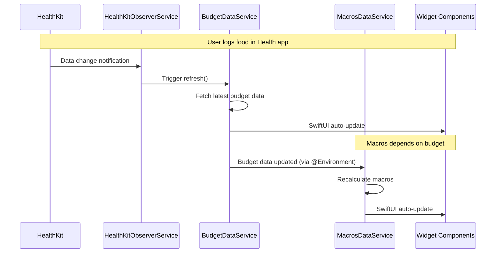

# HealthVaults Widget Reactivity Design Review

## Session Objective
Design a modern, reactive widget system that automatically updates both dashboard and homescreen widgets when HealthKit data changes, replacing the current fragmented approach.

## Current System Analysis

### Problems Identified
1. **Multiple reactive patterns**: Property wrappers (@BudgetAnalytics), HealthDataNotifications service, manual refresh calls
2. **Inconsistent update mechanisms**: Some widgets use `.refreshOnHealthDataChange()`, others rely on manual refresh
3. **Complex data flow**: Data flows through multiple layers (HealthKit → Services → Wrappers → Widgets)
4. **Legacy architecture**: Mix of old property wrapper patterns and newer repository patterns
5. **Widget vs Dashboard inconsistency**: Different update mechanisms for dashboard vs homescreen widgets

### Current Architecture Components
- **Property Wrappers**: `@BudgetAnalytics`, `@MacrosAnalytics` - Legacy reactive patterns
- **HealthDataNotifications**: Observable service for data change notifications
- **WidgetDataRepository**: New centralized data repository
- **HealthKitObservers**: Manual observer query management
- **Analytics Services**: Business logic services (BudgetService, MacrosAnalyticsService)

### Key Research Findings from Apple Docs

#### WidgetKit Best Practices
1. **Timeline-driven updates**: Widgets should use `TimelineProvider` for predictable updates
2. **Budget management**: WidgetKit has strict refresh budgets (40-70 per day)
3. **Minimum refresh interval**: 5+ minutes between updates
4. **Background considerations**: Widget extensions run in separate processes

#### HealthKit Integration
1. **Observer queries**: `HKObserverQuery` for real-time change notifications
2. **Background execution**: Observer callbacks execute in background
3. **Data fetching**: Separate queries needed to fetch actual data after notifications

## Requirements & Constraints

### Functional Requirements
- [x] Complete replacement of legacy property wrapper system
- [x] Event-based updates (no polling) triggered by HealthKit data changes
- [x] Identical visual appearance - NO visual changes whatsoever
- [x] Reusable components for dashboard and homescreen widgets
- [x] Clean migration - remove legacy code immediately upon replacement
- [x] Two homescreen widgets: Budget and Macros (medium size only)
- [x] Overview widget remains dashboard-only

### Technical Constraints
- [x] Event-driven architecture (HealthKit observer queries)
- [x] No repository pattern (unless compelling justification)
- [x] SwiftUI reactive programming patterns
- [x] Separate processes for widget extensions
- [x] HealthKit background execution limitations

## Detailed Solution Architecture

### Key Insights from Discussion
1. **Generic services without data/time logic** - Services handle only data fetching/observation, no widget-specific logic
2. **Environment dependency chain** - Services can depend on other environment services using modern SwiftUI patterns
3. **Widget extension independence** - Widgets should manage their own observers for architectural soundness
4. **Size-only styling** - Dashboard and homescreen share identical designs, only size differs

### Architecture Components

#### 1. Observable Data Services (Environment-Injected)
```swift
@Observable
class BudgetDataService {
    private(set) var budgetService: BudgetService?

    // Generic refresh - no widget-specific logic
    func refresh() async { /* fetch latest data */ }
}

@Observable
class MacrosDataService {
    @Environment(BudgetDataService.self) private var budgetDataService // Dependency
    private(set) var macrosService: MacrosAnalyticsService?

    func refresh() async { /* uses budgetDataService.budgetService */ }
}
```

#### 2. Unified HealthKit Observer Service
```swift
@Observable
class HealthKitObserverService {
    // Generic observer management - no widget-specific logic
    func startObserving(for dataTypes: [HealthKitDataType], onUpdate: @escaping () async -> Void)
    func stopObserving()
}
```

#### 3. Reusable Widget Components
```swift
struct BudgetComponent: View {
    @Environment(BudgetDataService.self) private var dataService
    let size: WidgetSize // .medium, .small, .large

    var body: some View {
        // Identical design, size-responsive layout
    }
}
```

#### 4. Widget Extension Strategy
**Decision: Independent observers** - Widget extensions run in separate processes and should be self-contained. They'll instantiate their own observer services but reuse the same data service logic.

### Data Flow Architecture
```
HealthKit Change → Observer Service → Data Service Refresh → SwiftUI Auto-Update → UI
```

### Environment Dependency Chain
```
App Level: HealthKitObserverService, BudgetDataService
↓
MacrosDataService (depends on BudgetDataService)
↓
Widget Components (depend on respective data services)
```

### Visual Architecture Diagrams

```mermaid
graph TB
    subgraph "Main App Process"
        HKO[HealthKitObserverService]
        BDS[BudgetDataService]
        MDS[MacrosDataService]

        BDS --> |observes| HKO
        MDS --> |depends on| BDS
        MDS --> |observes| HKO

        subgraph "Dashboard Views"
            DC[DashboardWidgets]
            BC[BudgetComponent - medium]
            MC[MacrosComponent - medium]
            OW[OverviewWidget - dashboard only]
        end

        BC --> |@Environment| BDS
        MC --> |@Environment| MDS
        DC --> BC
        DC --> MC
        DC --> OW
    end

    subgraph "Widget Extension Process"
        WHK[HealthKitObserverService - Widget]
        WBD[BudgetDataService - Widget]
        WMD[MacrosDataService - Widget]

        WBD --> |observes| WHK
        WMD --> |depends on| WBD
        WMD --> |observes| WHK

        subgraph "HomeScreen Widgets"
            BWP[BudgetTimelineProvider]
            MWP[MacrosTimelineProvider]
            WBC[BudgetComponent - medium]
            WMC[MacrosComponent - medium]
        end

        BWP --> WBC
        MWP --> WMC
        WBC --> |uses| WBD
        WMC --> |uses| WMD
    end

    HealthKit[HealthKit Store] --> |data changes| HKO
    HealthKit --> |data changes| WHK
```



## Migration Strategy

### Phase 1: Create New Services (No Breaking Changes)
1. Create `BudgetDataService` and `MacrosDataService`
2. Create unified `HealthKitObserverService`
3. Implement environment injection at app level

### Phase 2: Create Reusable Components
1. Extract existing widget content into `BudgetComponent`/`MacrosComponent`
2. Replace current widgets with new components
3. Verify identical visual appearance

### Phase 3: Replace Property Wrappers
1. Update dashboard to use new components with environment services
2. Update widget timeline providers to use new services
3. Remove old `@BudgetAnalytics`/`@MacrosAnalytics` wrappers

## Final Agreed Solution

### ✅ Architecture Confirmed
- **Event-driven reactive system** using modern SwiftUI @Observable and @Environment patterns
- **Generic data services** with environment dependency injection
- **Independent widget extensions** with their own observer services
- **Reusable components** with size-only variants
- **Clean migration strategy** - delete legacy first, then implement new

### ✅ Implementation Approach
- **Minimal changes principle** - least disruptive path to new architecture
- **Cleanup-first methodology** - remove/rename legacy before adding new
- **Zero visual changes** - preserve exact current appearance
- **Environment dependencies work automatically** - no special handling needed

## Implementation Action Items

### Phase 1: Clean Legacy & Create Services
- [ ] **DELETE**: Remove `WidgetDataRepository` and related files
- [ ] **DELETE**: Remove analytics wrapper files (`BudgetWrapper.swift`, `MacrosWrapper.swift`, etc.)
- [ ] **DELETE**: Remove `HealthDataNotifications` service
- [ ] **CREATE**: `BudgetDataService` (@Observable)
- [ ] **CREATE**: `MacrosDataService` (@Observable, depends on BudgetDataService)
- [ ] **CREATE**: Unified `HealthKitObserverService`
- [ ] **INJECT**: Environment services at app level

### Phase 2: Reusable Components
- [ ] **EXTRACT**: Current widget content into `BudgetComponent`/`MacrosComponent`
- [ ] **REPLACE**: Dashboard widgets with new components
- [ ] **REPLACE**: Widget timeline providers with new components
- [ ] **VERIFY**: Identical visual appearance maintained

### Phase 3: Final Cleanup
- [ ] **DELETE**: Remaining property wrapper files
- [ ] **DELETE**: Old analytics service files if unused
- [ ] **VERIFY**: No legacy code remains
- [ ] **TEST**: Event-driven updates working correctly

## Success Criteria
✅ Zero visual changes
✅ Event-driven HealthKit updates
✅ Identical dashboard and homescreen widgets
✅ No legacy code remaining
✅ Maintainable, extensible architecture

## Next Steps
Ready to proceed with implementation starting with Phase 1 cleanup and service creation.
