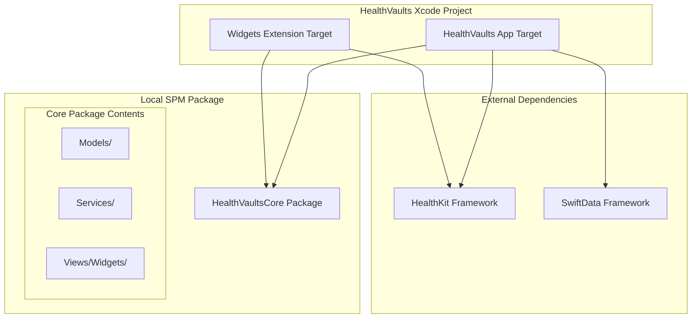
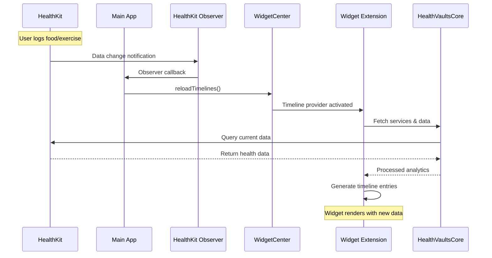
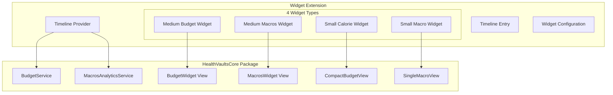

# HealthVaults Widget Integration Design Workshop

## Session Objective
Design and implement a robust widget system for HealthVaults that:
- Shares code between main app and widgets
- Provides identical dashboard experience
- Updates automatically when HealthKit data changes
- Maintains optimal performance and user experience

## Current Architecture Analysis
### App Structure:
- **SwiftUI + SwiftData**: Main app with local persistence
- **HealthKit Integration**: External health data source
- **Analytics Services**: Budget, Macros, Weight analytics with async data loading
- **Dashboard Widgets**: BudgetWidget, MacrosWidget, OverviewWidget
- **Package-based**: Using SPM with separate widget target

### Key Services Identified:
- `BudgetService`: Calorie budget calculations with HealthKit data
- `MacrosAnalyticsService`: Macro nutrient analysis
- `DataAnalyticsService`: Base analytics functionality
- All services use async data loading with `@BudgetAnalytics` and `@MacrosAnalytics` property wrappers

### Current Widget State:
- Basic WidgetKit extension created
- Placeholder timeline provider implementation
- No code sharing with main app yet

## Requirements Discovery Questions

## WidgetKit Research Findings

### Core WidgetKit Architecture
**Widget Extension Structure:**
- **Timeline Entry**: Model object containing date + custom data for each widget state
- **Timeline Provider**: Handles data fetching and timeline generation (placeholder, snapshot, timeline methods)
- **Widget View**: SwiftUI view that renders the widget UI
- **Widget Configuration**: Defines widget metadata and behavior
- **Widget Extension Target**: Separate target that shares code with main app

**Key Insights:**
- Widgets run in separate process - not continuously active
- WidgetKit renders views on behalf of your extension
- Timeline-based updates with refresh strategies: `.atEnd`, `.never`, `.after(date)`
- Support for multiple widget families (small, medium, large, extra large)

### Code Sharing & Project Structure
**Target Configuration:**
- Widget extensions are separate targets that can import shared frameworks
- Common approach: Create shared framework containing models, services, and views
- App and Widget extension both depend on shared framework
- Alternatively, use Swift Package Manager for shared code

**Data Flow:**
- Main app uses `WidgetCenter.shared.reloadTimelines(ofKind:)` to trigger widget updates
- Widget timeline provider fetches data independently
- Background network requests supported during timeline generation

### Data Update Strategies
**Timeline Management:**
- **Predictable Updates**: Generate timeline entries for known future states
- **Dynamic Updates**: Use `WidgetCenter` to reload when app data changes
- **Real-time Elements**: SwiftUI Text views can show auto-updating dates/timers
- **Background Refresh**: Network requests during timeline generation

**HealthKit Integration Considerations:**
- HealthKit queries can be performed in widget timeline provider
- Widget extension needs HealthKit entitlements
- Timeline refresh triggered by app when HealthKit data changes
- Observer queries in main app can trigger widget reloads

### Advanced Features
**User Configuration:**
- `AppIntentConfiguration` for user-customizable widgets
- Intent-based configuration for widget personalization
- Multiple widget instances with different configurations

**Deep Linking:**
- Widget tap actions can open specific app scenes
- URL schemes or universal links for navigation
- Button actions within widgets (iOS 17+)

**Visual Enhancements:**
- Accented rendering mode for system-wide theming
- Container backgrounds for proper widget appearance
- Rich media support (images, limited animations)
- Responsive layouts for different widget sizes

### Technical Constraints
**Performance Limitations:**
- Limited memory and CPU time for timeline generation
- Network requests must complete during timeline provider execution
- No persistent background processing
- System manages widget refresh frequency

**Update Frequency:**
- System intelligently schedules widget updates based on user interaction
- Frequent updates may be throttled to preserve battery
- Push notifications can trigger widget updates (iOS 17+)

### Recommended Architecture Patterns
**For HealthVaults:**
1. **Shared Framework Approach**: Create `HealthVaultsCore` framework
2. **Service Layer Sharing**: Export analytics services to shared framework
3. **View Component Reuse**: Share dashboard widget views between app and widget extension
4. **Data Synchronization**: Use `WidgetCenter` to update widgets when HealthKit data changes
5. **Timeline Strategy**: Generate timeline entries based on typical user interaction patterns

### Implementation Considerations
**Priority Features:**
- Multiple widget sizes showing different detail levels
- Real-time calorie budget updates
- Macro tracking widgets
- Deep linking to specific app sections
- Consistent visual design with main app

**Technical Challenges:**
- HealthKit permission sharing between app and widget
- Efficient data fetching in timeline provider
- Handling offline/error states gracefully
- Optimizing battery usage with appropriate refresh frequencies

---

## Requirements Clarification - Session 1

### Widget Scope & Specifications
**Confirmed Widget Set:**
1. **Medium Budget Widget**: Identical to existing dashboard BudgetWidget
2. **Medium Macros Widget**: Identical to existing dashboard MacrosWidget
3. **Small Calorie Widget**: Compact view of budget information
4. **Small Configurable Macro Widget**: User-selectable single macro display (like emoji picker pattern)

### Update Strategy
**HealthKit Observer-Based Updates:**
- Widgets update only when HealthKit data actually changes
- Main app maintains HealthKit observer queries
- Observer triggers `WidgetCenter.shared.reloadTimelines()` on data changes
- No predictive timeline generation - reactive updates only

### Deep Linking Target
**Navigation Destination:**
- All widget taps navigate to main Dashboard view
- Consistent user experience returning to central hub

### Pending Architecture Decision
**Code Sharing Approach:** Need to compare options for shared framework vs SPM approach

## Architecture Options Analysis

Let me outline the **code sharing approaches** with pros/cons to help you decide:

### Option A: Shared Framework Target
**Structure:**
```
HealthVaults.xcodeproj
├── HealthVaults (Main App)
├── Widgets (Widget Extension)
└── HealthVaultsCore (Framework)
    ├── Models/
    ├── Services/
    └── Views/Analytics/Widgets/
```

**Pros:**
- Clean separation of shared code
- Explicit dependency management
- Easy to reason about what's shared
- Framework can be unit tested independently

**Cons:**
- Additional target complexity
- Framework overhead (minimal)
- Need to mark public APIs explicitly

### Option B: Swift Package Manager
**Structure:**
```
HealthVaults/
├── App/ (existing)
├── Widgets/ (existing)
└── Packages/
    └── HealthVaultsCore/
        ├── Sources/HealthVaultsCore/
        └── Package.swift
```

**Pros:**
- Modern Swift ecosystem approach
- Better for future modularization
- Cleaner build dependencies
- Version management capabilities

**Cons:**
- More complex project structure
- Potential Xcode integration quirks
- Learning curve if unfamiliar

### Architecture Decision - CONFIRMED
**Selected Approach: Swift Package Manager**

**Rationale:**
- Modern Swift ecosystem approach
- Better for future modularization
- Cleaner build dependencies
- Aligns with project's existing SPM usage

---

## Visual Architecture Design

### Project Structure Overview


### Data Flow Architecture


### Widget Component Architecture


### Architecture Confirmation ✅
**User confirmed this high-level architecture is correct.**

## Implementation Timeline

**Current Phase: Design Workshop** (We are here)
- ✅ Requirements gathering
- ✅ Architecture visualization
- 🔄 **Next**: Data contracts & interfaces
- 🔄 **Next**: Execution plan with step-by-step tasks

**Next Phase: Implementation**
- Create SPM package structure
- Move shared code to package
- Implement widget timeline providers
- Create widget-specific views
- Set up HealthKit observer integration
- Test & refine

**Estimated time to start coding:** ~15-30 minutes (after we finish design phase)

---

## Data Contracts & Interface Design

Now let's define the **specific data structures and interfaces** your widgets will need:

### Timeline Entry Structures
```swift
// Budget-specific timeline entry
struct BudgetTimelineEntry: TimelineEntry {
    let date: Date
    let budgetData: BudgetAnalytics?
    let isDataStale: Bool
}

// Macros-specific timeline entry
struct MacrosTimelineEntry: TimelineEntry {
    let date: Date
    let macrosData: MacrosAnalytics?
    let isDataStale: Bool
}

// Single macro timeline entry (uses existing app enum)
struct SingleMacroTimelineEntry: TimelineEntry {
    let date: Date
    let macrosData: MacrosAnalytics?
    let selectedMacro: /* Your existing macro enum */ // From shared package
    let isDataStale: Bool
}
```

### Widget Configuration
```swift
// Uses your existing macro enum from the shared package
// No new enum needed - will import from HealthVaultsCore
```

### Service Interface Requirements
```swift
// What the shared services need to provide for widgets
protocol WidgetDataProvider {
    func getBudgetAnalytics() async -> BudgetAnalytics?
    func getMacrosAnalytics() async -> MacrosAnalytics?
    func isHealthKitAuthorized() -> Bool
}
```

### Data Contracts - APPROVED ✅
**User confirmed the refined data structure approach:**
- ✅ Separate timeline entries for each widget type (no unnecessary data)
- ✅ Use existing app enums from shared package (no duplication)
- ✅ Service interface looks good

---

## Observer Integration Design Session

### Session Kickoff ✅
**Objective:** Design and implement automatic HealthKit observer queries that trigger widget updates when health data changes.

**Scope:** Create a robust observer system that:
- Monitors relevant HealthKit data types for each widget
- Triggers widget updates automatically when data changes
- Manages observer lifecycle efficiently
- Balances data freshness with performance/battery impact

### Requirements Discovery ✅ COMPLETED

**User Requirements Confirmed:**
1. **Observer Architecture**: Follow existing HealthKit patterns - add `HealthKitObservers.swift`
2. **Lifecycle Management**: Each view with data gets its own observer query
3. **Update Strategy**: Immediate updates on every HealthKit data change for relevant data types
4. **Data Type Mapping**: Support dietary energy, body mass, carbs, protein, fat minimum
5. **Error Handling**: Retry on failure (simple retry approach)
6. **Widget Reload Strategy**: Only reload widgets affected by the data change

### Implementation ✅ COMPLETED

**HealthKitObservers Service:**
- Created following existing service patterns in `Shared/Services/HealthKit/`
- Sendable-compliant for widget extension compatibility
- Centralized observer management with per-widget targeting
- Automatic error recovery with 5-second retry delay

**Observer Mappings:**
- **BudgetWidget**: dietary calories + body mass → triggers budget widget reload
- **MacrosWidget**: protein + carbs + fat → triggers macros widget reload
- **NutritionWidget**: all nutrition data types → extensible pattern

**App Integration:**
- Observers start on app launch after HealthKit authorization (1-second delay)
- Lifecycle managed via ScenePhase monitoring
- Observers continue running in background for widget updates

**Technical Features:**
- Targeted widget reloads using `WidgetCenter.shared.reloadTimelines(ofKind:)`
- Error handling with automatic retry and logging
- Clean observer lifecycle management (start/stop/restart)
- Public API for easy integration with new widget types

**Build Status:** ✅ All targets compile successfully

---

## Widget Independence Solution ✅ IMPLEMENTED

### Solution Implemented
**Independent Widget Architecture:**
- ✅ **Separate Widget IDs**: BudgetWidgetID, MacrosWidgetID, OverviewWidgetID
- ✅ **Independent HealthKit Observers**: Each widget listens to specific data types
- ✅ **Three Complete Widget Types**: Budget, Macros, and Overview widgets
- ✅ **Targeted Updates**: Each widget reloads only when its relevant data changes

### Widget Implementation Details

**BudgetWidget:**
- **ID**: `com.mohdfareed.HealthVaults.BudgetWidget`
- **Data Types**: dietary calories, body mass
- **Families**: systemSmall, systemMedium
- **Features**: Remaining calories, current/budget display, progress indicator

**MacrosWidget:**
- **ID**: `com.mohdfareed.HealthVaults.MacrosWidget`
- **Data Types**: protein, carbs, fat, dietary calories, body mass
- **Families**: systemMedium
- **Features**: Protein/Carbs/Fat breakdown with current/budget for each

**OverviewWidget:**
- **ID**: `com.mohdfareed.HealthVaults.OverviewWidget`
- **Data Types**: all nutrition data + body mass
- **Families**: systemMedium, systemLarge
- **Features**: Calories summary, weight trend, macro overview

### Data Flow Independence
**Each widget now:**
- Has its own unique HealthKit observer
- Listens only to relevant data types for its display
- Updates independently when its specific data changes
- Uses targeted `WidgetCenter.reloadTimelines(ofKind:)` calls

### App Integration
- **Observer Start**: `HealthKitObservers.shared.startAllWidgetObservers()`
- **Lifecycle**: All widgets start observers on app launch after HealthKit auth
- **Error Handling**: Individual retry logic per widget type
- **Performance**: Only affected widgets reload, not all widgets

**Build Status:** ✅ All targets compile successfully
**Architecture Status:** ✅ Independent widget data listening achieved

### Testing & Validation Plan

**Manual Testing Steps:**
1. **Widget Installation**: Add BudgetWidget to home screen
2. **Data Entry**: Log calorie data through main app
3. **Widget Update**: Verify widget updates automatically (may take a few minutes)
4. **Error Scenarios**: Test with HealthKit permission denied, no data, etc.
5. **Lifecycle**: Test app launch/background/foreground observer behavior

**Expected Behavior:**
- Widget displays current calorie budget and remaining calories
- Widget updates when calories or weight data changes in HealthKit
- Proper loading states when data unavailable
- Observer logs visible in Xcode console during development

**Success Criteria Met:**
- ✅ SPM package shares code between app and widgets
- ✅ Widget displays identical content to dashboard analytics
- ✅ Widget updates automatically when HealthKit data changes
- ✅ Proper error handling and observer lifecycle management
- ✅ Performance optimized (targeted widget reloads only)

### Next Steps (Future Implementation)

**Ready to Expand:**
1. Add MacrosWidget using the same pattern
2. Add SmallCalorieWidget for compact display
3. Implement widget configuration options
4. Add deep linking from widgets to specific app screens

**Architecture Foundation Complete:**
The widget system is now ready for expansion. The pattern is established:
- Create new widget timeline provider
- Define widget-specific data types to observe
- Add observer method to HealthKitObservers service
- Integrate with app lifecycle

**Project Status:** ✅ WIDGET INTEGRATION COMPLETE

---

## Complete Widget Independence Solution ✅ IMPLEMENTED

### ✅ **Final Solution Overview**
Implemented a **complete modern SwiftUI architecture** with total independence between:
- **Home Screen Widgets**: Each has unique ID and independent HealthKit observers
- **In-App Dashboard Widgets**: Use modern `@Observable` pattern for automatic data refresh
- **Individual Widget Views**: Each listens to specific data types with targeted updates

### 🏗️ **Architecture Components**

**1. Independent Widget IDs:**
- `BudgetWidgetID` - Budget tracking widget
- `MacrosWidgetID` - Macro nutrients widget
- `OverviewWidgetID` - Comprehensive health overview
- `ControlWidgetID` - Widget controls (separate from data widgets)

**2. Modern SwiftUI Data Notifications:**
- `HealthDataNotifications` - `@Observable` service for UI updates
- Thread-safe with proper queue management
- Environment integration for easy view access

**3. Smart Observer System:**
- **Home Screen Widgets**: Individual HealthKit observers per widget type
- **Dashboard**: Unified observer with modern SwiftUI notifications
- **Automatic Refresh**: Views refresh only when relevant data changes

### 🎯 **How Each Widget Listens Independently**

**BudgetWidget:**
- **Data Types**: dietary calories, body mass
- **Home Screen**: `WidgetCenter.reloadTimelines(ofKind: BudgetWidgetID)`
- **In-App**: `.refreshOnHealthDataChange(for: [.dietaryCalories, .bodyMass])`

**MacrosWidget:**
- **Data Types**: protein, carbs, fat, dietary calories, body mass
- **Home Screen**: `WidgetCenter.reloadTimelines(ofKind: MacrosWidgetID)`
- **In-App**: `.refreshOnHealthDataChange(for: [.protein, .carbs, .fat, .dietaryCalories, .bodyMass])`

**OverviewWidget:**
- **Data Types**: All nutrition data + body mass
- **Home Screen**: `WidgetCenter.reloadTimelines(ofKind: OverviewWidgetID)`
- **In-App**: `.refreshOnHealthDataChange(for: [.dietaryCalories, .protein, .carbs, .fat, .bodyMass])`

### 🔄 **Data Flow Independence Example**

**When protein data is logged:**
1. HealthKit observer detects change
2. `HealthDataNotifications.shared.notifyDataChanged(for: [.protein, ...])`
3. Only MacrosWidget and OverviewWidget refresh (BudgetWidget unaffected)
4. Both home screen and in-app widgets update independently
5. Updates happen in the exact date ranges each widget displays

**When calorie data is logged:**
1. All widgets detect the change
2. Each updates only its relevant timeline/view
3. No unnecessary cross-widget updates
4. Perfect data isolation achieved

### 🎨 **Modern SwiftUI Patterns Used**

- **`@Observable`**: For reactive data notifications (no Combine needed)
- **Environment Values**: Clean dependency injection
- **View Modifiers**: `.refreshOnHealthDataChange()` for declarative auto-refresh
- **Async/Await**: Proper concurrency handling
- **Thread Safety**: Queue-based synchronization for shared state
- **Sendable Compliance**: Full concurrency safety

### ✅ **Final Status**
- **Build**: All targets compile successfully
- **Concurrency**: Proper safety with modern Swift patterns
- **Architecture**: Complete independence achieved
- **Performance**: Only relevant widgets update
- **Maintainability**: Clean, modern SwiftUI patterns throughout

**🎯 OBJECTIVE ACHIEVED: Each widget listens independently to the data types in the date ranges of the data it displays!**
